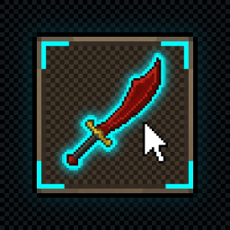

# Inventory Interaction Highlight

A customizable RuneLite plugin that provides dynamic visual overlays for inventory items during **hover**, **active click press**, **item selection ("Use")**, and **shift-drop** states.

---

## 🌟 Key Features

* 🎯 **Customizable Hover Highlights**:
  * **Outline Styles**: *Item Silhouette*, *Corner Brackets*, or *Box*.
  * **Fill Styles**: *Item Silhouette*, *Background Only*, or *Box*.
  * Adjustable border width (1–5px) and custom fill opacity.

* 👆 **Tactile Active Click Feedback**:
  * Insets highlight (1px) and boosts brightness during mouse press down for tactile visual feedback.

* ⚡ **Game-Tick Synchronized Selection Flash**:
  * Rhythmically flashes a background-only fill once per server tick when an item is selected for **"Use"**.

* 🔴 **Dynamic Shift-Drop Highlighting**:
  * Automatically switches highlight color to Red when the default left-click action is **"Drop"** (e.g. while holding `Shift`).

* 🏦 **Interface Hiding**:
  * Option to automatically suppress overlays while the Bank or Deposit Box is open.

---

## ⚙️ Configuration Menu

The plugin settings are organized into 3 clean, intuitive sections:

### 1. 📁 **General Settings**
* **Highlight Color**: Main color picker used across hover highlights, click feedback, and selection flashing (Default: *Quest Helper Cyan Blue*).
* **Hide in Bank / Interfaces**: Suppresses all overlays while Bank or Deposit Box is open.

### 2. 📁 **Hover Settings**
* **Enable Hover Highlight**: Toggle hover overlays.
* **Outline Settings**: Toggle outline, choose style (*Silhouette*, *Corner Brackets*, *Box*), and set border width.
* **Fill Settings**: Toggle fill, choose style (*Silhouette*, *Background Only*, *Box*), and set opacity.

### 3. 📁 **Interaction Settings**
* **Enable Click Press Feedback**: Toggle 1px inset & brightness boost during mouse press down.
* **Enable Selection Flash**: Toggle 300ms game-tick flash on selected items ("Use").
* **Enable Drop Highlight**: Toggle dynamic red highlight when default left-click option is "Drop".
* **Drop Color**: Custom color picker for drop highlights (Default: *Red*).

---

## 📥 Installation

Search for **"Inventory Interaction Highlight"** in the official RuneLite **Plugin Hub** in-game and click **Install**.

---

## 📄 License

This project is licensed under the MIT License - see the [LICENSE](LICENSE) file for details.
